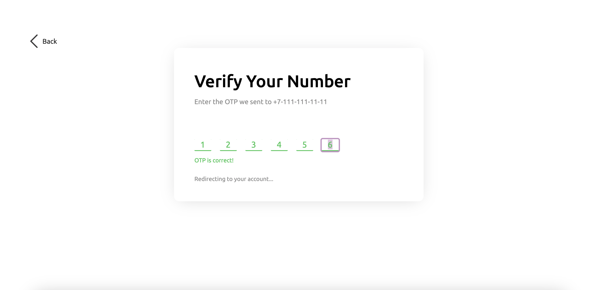
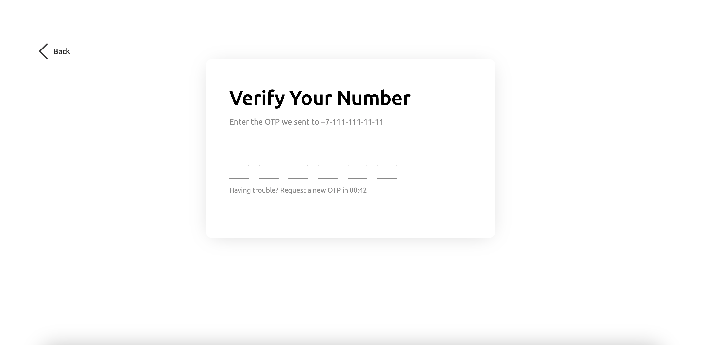

# Тестовое задание: Проверка одноразового пароля

## Оглавление

- [Обзор проекта](#обзор-проекта)
  - [Задачи проекта](#задачи-проекта)
  - [Функциональность проекта](#функциональность-проекта)
  - [Screenshot](#screenshot)
  - [Директории проекта](#директории-проекта)
  - [Запуск проекта](#запуск-проекта)
  - [Ссылки](#ссылки)
- [Ход выполнения проекта](#ход-выполнения-проекта)
  - [Используемые технологии](#используемые-технологии)
  - [Чему я научилась, работая над проектом](#чему-я-научилась-работая-над-проектом)
- [Автор](#автор)

## Обзор проекта

### Задачи проекта

Создать сервис проверки одноразовых паролей (one time password - OTP).

### Функциональность проекта

Функционально проект представляет из себя SPA, позволяющее производить проверку одноразового пароля.

Функциональность:

- вводить можно только цифры, любые другие символы ввести нельзя;
- работает функционал копировать-вставить;
- фейковая проверка пароля, не нужно API;
- после успешного ввода пароля и показа надписи “Redirecting to your account…” реализован переход на любую страницу (используя роутинг), но на нее нельзя перейти не введя успешный пароль;
- на странице есть таймер (минута) после которого появляется кнопка “Request a new OTP” - ее нажатие приводит к перезапуску таймера.

### Screenshot

### Директории проекта

- `src/components` — директория с компонентами
- `src/contexts` — директория с контекстами
- `src/pages` — директория с корневыми файлами страниц
- `src/utils` — директория со вспомогательными утилитами
- `src/images` — директория с изображениями

### Запуск проекта

- `npm run build` — запуск проекта в режиме продакшн
- `npm start` — запуск проекта в режиме разработки

### Ссылки

- [Ссылка на репозиторий проекта](https://github.com/AlenaElegecheva/one-time-password)
- [Ссылка на демо-страницу проекта](https://one-time-password-navy.vercel.app)

## Ход выполнения проекта

### Используемые технологии

- HTML
- CSS
- JS
- [React](https://react.dev/)
- [React Router](https://reactrouter.com/en/main)
- [CSS Modules](https://create-react-app.dev/docs/adding-a-css-modules-stylesheet/)
- [ClassNames utility](https://github.com/JedWatson/classnames)
- Адаптивная вёрстка

### Чему я научился работая над проектом

- Закрепила знания по React

## Автор

**Алена Елегечева**

- e-mail: [alena.elegecheva@gmail.com](mailto:alena.elegecheva@gmail.com)
- Telegram: [@ElegAN2006](https://t.me/ElegAN2006)